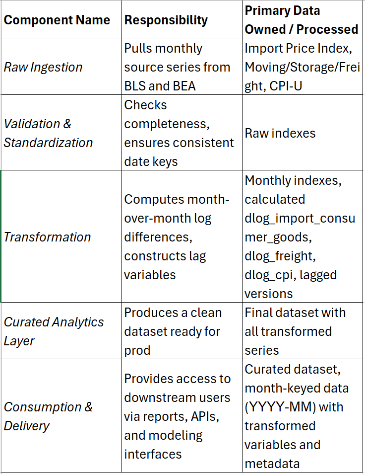

#1. Problem Definition
    ##Problem statement 
        
My system will explore inflation prediction for a regional bank in Texas over the next thirty years. Inflation can affect many different areas of financial institutions such as CD purchasing, stock prices, and company morale (if the institution has to cut salaries.) More than that, inflation helps predict the health and growth of the financial institution in the next few decades, which can influence planning and future decisions made by the insititution's leadership and stockholders.

    ##Why this problem?
        
I have experience working with financial institutions as well as forecasting calculations like inflation. After looking at some of the other data in the BLS data system, I thought this would be an interesting project that would hold my attention for the rest of the semester. I would also just like to know if we're going to have a repeat of The Great Depression as well, if I'm being completely honest.

    ##Scope boundaries
        
Any data related to inflation (import price index, import costs, domestic consumper pricing) will be within scope. There will be multiple prediction models made to get a more accurate assessment of what the inflation trend might look like given different circumstances and policy changes. Things that are explicity out of scope include specific pieces of data like data that is separated between nonfarm and private businesses. This is a big picture study that needs to be kept that way.

    ##Success criteria
        
I think this a two-prong answer. The easiest answer would be that the system consistently produces models that looks similar to inflation forecast predictions produced by BLS or the S&P500. The harder answer would be that in thirty years, I would hope the models would have predicted seasonal rise and fall even if it wasn't perfectly accurate on specific month-related timing.

#2. Data Pipeline Definition
    ##Data sources
        
I will be using the <i>Monthly import price index for BEA End Use, All commodities, not seasonally adjusted</i>, <i>Monthly import price index for BEA End Use 4, Consumer goods, excluding automotives, not seasonally adjusted</i>, <i>Moving, storage, freight expense in U.S. city average, all urban consumers, not seasonally adjusted</i>, and <i>CPI for All Urban Consumers (CPI-U) 1982-84=100 (Unadjusted) - CUUR0000SA0</i>.

    ##Data relationships
        
These sources are all seasonally unadjusted, and I will use the years 1990-2025 across all the sources to keep it consistent. Using the years as a common key, I'll convert to log differences to calculate a monthly inflation rate.

    ##Transformation requirements
        
I will have to filter for blank months within the years. Those may just be deleted if there aren't very many. I believe there was only one blank in the dataset I pulled in Foundation 1. Log differences will need to be performed in order to get usable statistics that can then by forecasted month-over-month. As long as I have the approximate percent change over time of inflation, I should have what I need to forecast it.

    ##Output shape
        
The processed data looks like a monthly, time-aligned panel, using a YYYY-MM key. All series are rebased to a common index year and transformed into month-over-month log differences. Each row contains variables such as dlog_import_consumer_goods, dlog_import_all, dlog_freight, and dlog_cpi, along with selected lag versions (e.g., import_lag1, import_lag3). Downstream users, reports, APIs, and models receive a clean, stationary dataset of comparable monthly percent changes—ready for correlation analysis, regression, or pass-through modeling rather than raw index levels for better decision-making in the future.

#3. Architecture Characteristics - Driving and Implicit
    ##Driving characteristics: 
        
The top three characteristics driving the architecture are data consistency, timeliness, and reproducibility. Data consistency is critical because even small misalignments can distort month-over-month log differences and break downstream models; we’d measure this through validation checks like schema tests, base-year verification, reconciliation against source values. Timeliness matters because these are monthly economic indicators used for monitoring and forecasting; we’d measure it by data freshness SLAs by ingesting within X hours of release. Failure to keep data fresh would make reports models lag behind real-world shifts. Reproducibility is essential since transformations must be transparent. Otherwise, there would be no reason to forecast at all.

    ##Implicit characteristics
        
The data needs to be protected, available, and cannot randomly break when stakeholders need it. This means we need to define security access carefully using roles and perhaps even active directory to keep everything flowing smoothly. There should also be a digital and physical backup, and the physical backup should be stored at an alternative backup site.

    ##Characteristic trade-offs
        
The main tension is between timeliness and results consistency/reliability. Ingesting data immediately after release can conflict with thorough validation, reconciliation, and documentation. If we had to, it would be prudent to sacrifice speed for consistency. There's no reason to push flawed data if it can be helped and there's no active crisis. There’s also some tradeoff between flexibility and strict consistency checks; we’re willing to limit ad hoc changes and enforce tighter schemas to protect downstream reliability, even if that slows rapid experimentation.

#4. Architecture Style Selection
    ##Selected style
        
Layered data pipeline architecture (batch-oriented ETL)

    ##Why this style?
        
The datasets used require a layered data pipepline that can handle batches well in separate stages: raw ingestion → validation/standardization → transformation (rebasing, month-over-month log differences, lag construction) → curated analytics layer → consumption (APIs, reports, models).

    ##Alternatives considered
        
Microservices-style pipelines was the most appealing of the other styles because each transformation or enrichment step could be modularized and run independently, which is always nice when programming something complex. However, orchestrating multiple services, handling deployment, and managing many small services outweighed the benefit of a single mostly-linear ETL flow.

    ##Style-specific trade-offs
        
Making quick changes will take a longer time to process because the flow must start from the beginning. Again, we're sacrificing speed and modularization. It is also less suited to real-time analysis since we're relying on ingesting batches of data instead of constantly ingesting data. It's about reliability over speed with a layered data pipeline.

    ##Quantum analysis: How many architecture quanta does your design have? Why?
        
The design has five architecture quanta, each corresponding to a distinct, layer of the pipeline:
            -Raw ingestion
            -Validation & standardization
            -Transformation (calculates month-over-month log differences, constructs lags)
            -Curated analytics layer (produces final dataset to be published using APIs and reports)
            -Consumption & delivery (APIs, reports, and model interfaces)
            In order to make sure incomplete data or even a test does not make it downstream to production, these layers need to be split. It will also help making quick changes and processing them easier and faster

#5. Component Identification
    ##Component inventory
        
Please refer to the screenshot of the Excel document I created

    ##Partitioning approach
        
I will be using technical partitioning by layer, not domain-based. Each stage -- ingestion, validation, transformation, curated dataset, and delivery -- handles a specific step in the data flow, not a business capability. This keeps things simple, makes testing and versioning relatively easy, and ensures reproducibility.

    ##Boundaries
        
Each component has cohesion within its own responsibilities, minimizing cross-stage dependencies and making the pipeline easier to maintain, test, and reproduce.
